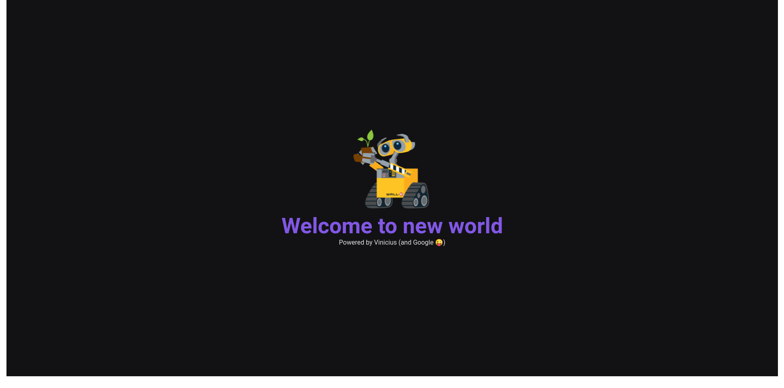

<h1 align="center">
    Modelo de sites
</h1>

  

  

  <!--  -->

  
  

  <!--  -->

  

<a href="https://modelo-site-sand.vercel.app" target="_blank" rel="noopener noreferrer"> Site Demostração</a>

<a href="https://vercel.com/new/clone?repository-url=https%3A%2F%2Fgithub.com%2Fviniciusnicassio%2FModeloSite%2F&demo-title=Modelo%20de%20sites&demo-description=Esse%20projeto%20%C3%A9%20meu%20estudo%20para%20criar%20um%20ambiente%20com%20as%20configura%C3%A7%C3%B5es%20corretas%20para%20usar%20as%20principais%20ferramentas%2C%20esse%20modelo%20ser%C3%A1%20usado%20como%20consulta%20para%20novos%20projetos.&demo-url=https%3A%2F%2Fmodelo-site-sand.vercel.app&demo-image=https%3A%2F%2Fraw.githubusercontent.com%2Fviniciusnicassio%2FModeloSite%2Fdevelop%2Fdocumentation%2Ftela.png"></a>

## :dart: Objetivo do projeto

Esse projeto é meu estudo para criar um ambiente com as configurações corretas para usar as principais ferramentas, esse modelo será usado como consulta para novos projetos.

## :crossed_swords: Desafios encontrados

Como todo começo o principal desafio é a correta configuração das bibliotecas sem gerar conflitos entre elas.

## :rocket: Tecnologias usadas:

- Typescript
- [Styled-components](https://styled-components.com/)
- [next-images](https://www.npmjs.com/package/next-images)
- [babel-plugin-inline-react-svg](https://www.npmjs.com/package/babel-plugin-inline-react-svg)
- [Jest](https://jestjs.io/pt-BR/)
- [SWR](https://swr.vercel.app/)

## :memo: License

Este projeto está sob a licença do MIT. Veja o [LICENSE](https://github.com/viniciusnicassio/ModeloSite/blob/main/LICENSE) para mais informações.

---

Feito com por Vinicius Ferreira :wave: [Entrar em contato!](https://www.linkedin.com/in/vinicius-nicassio-ferreira-66b54962/)
